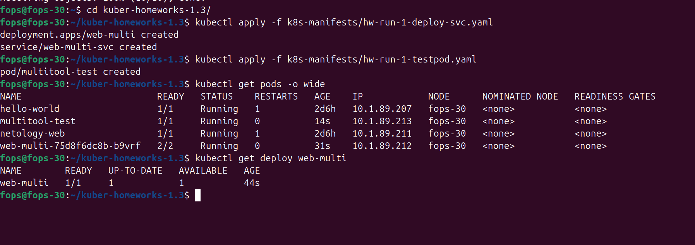
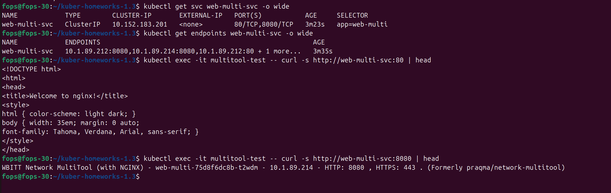
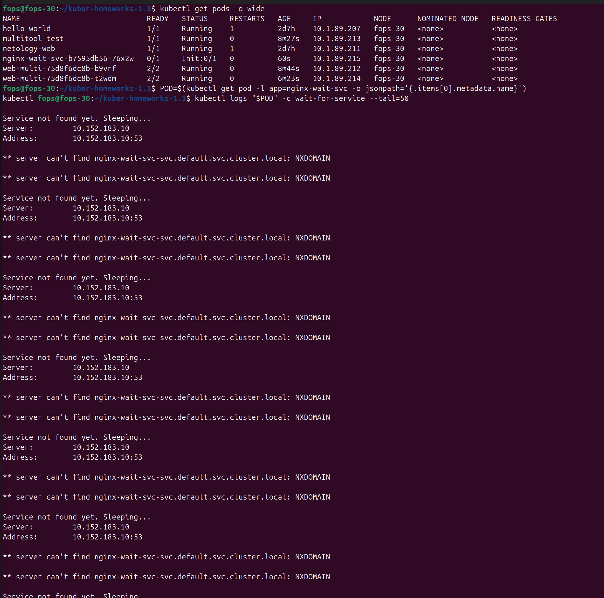
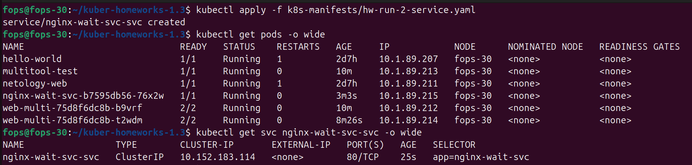
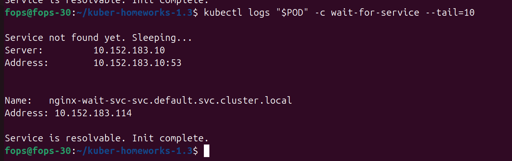

# ДДомашнее задание к занятию «Запуск приложений в K8S»

---

## Манифесты, используемые в работе
- [k8s-manifests/hw-run-1-deploy-svc.yaml](k8s-manifests/hw-run-1-deploy-svc.yaml)
- [k8s-manifests/hw-run-1-testpod.yaml](k8s-manifests/hw-run-1-testpod.yaml)
- [k8s-manifests/hw-run-2-init-deploy.yaml](k8s-manifests/hw-run-2-init-deploy.yaml)
- [k8s-manifests/hw-run-2-service.yaml](k8s-manifests/hw-run-2-service.yaml)

---

## Задание 1. Deployment с несколькими контейнерами и масштабирование

### Создание Deployment и Service
Применение манифестов:
```bash
kubectl apply -f k8s-manifests/hw-run-1-deploy-svc.yaml
kubectl apply -f k8s-manifests/hw-run-1-testpod.yaml
```

### Состояние Pod до масштабирования
```bash
kubectl get pods -o wide
kubectl get deploy web-multi
```

Скриншот:



### Масштабирование Deployment до 2 реплик
```bash
kubectl scale deployment/web-multi --replicas=2
```

Проверка:
```bash
kubectl get pods -o wide
kubectl get deploy web-multi
```

Скриншот:


### Service и endpoints
```bash
kubectl get svc web-multi-svc -o wide
kubectl get endpoints web-multi-svc -o wide
```

Скриншот:



### Проверка доступа к приложению из отдельного Pod
```bash
kubectl exec -it multitool-test -- curl -s http://web-multi-svc:80 | head
kubectl exec -it multitool-test -- curl -s http://web-multi-svc:8080 | head
```

Скриншот:



---

## Задание 2. Deployment с init-контейнером

### Запуск Deployment без Service
```bash
kubectl apply -f k8s-manifests/hw-run-2-init-deploy.yaml
```

### Состояние Pod до создания Service
```bash
kubectl get pods -o wide
kubectl describe pod -l app=nginx-wait-svc
```

Скриншот:



### Создание Service и завершение init-контейнера
```bash
kubectl apply -f k8s-manifests/hw-run-2-service.yaml
kubectl get pods -o wide
```

Скриншот:



---

## Вывод
В ходе выполнения домашнего задания были:
- развернуты приложения с использованием Deployment;
- продемонстрировано масштабирование приложения;
- обеспечен доступ к приложениям через Service;
- проверено сетевое взаимодействие между Pod'ами;
- показана работа init-контейнеров до и после создания Service.

